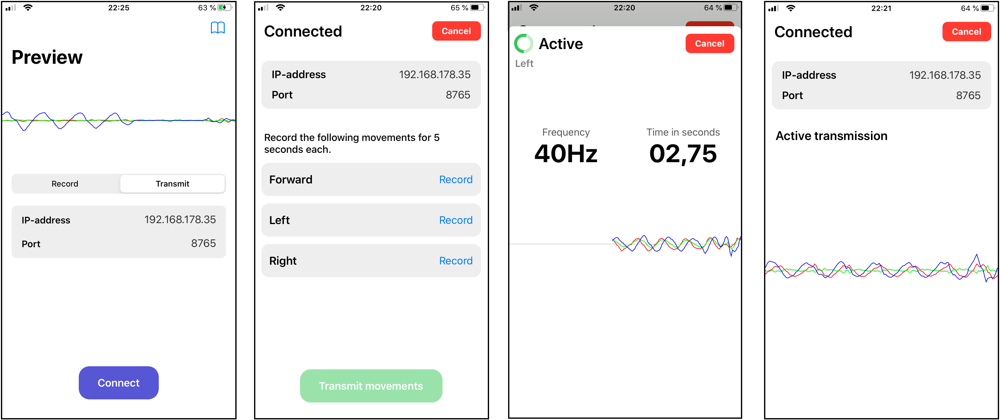
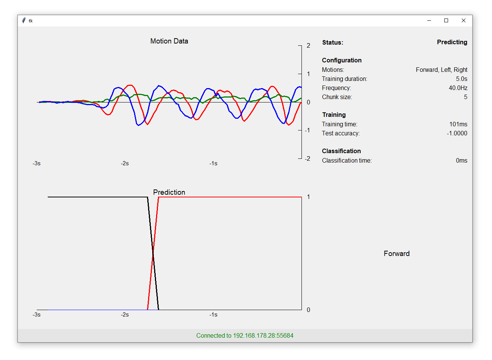

# motion

A framework that allows the real-time control of Python applications with smartphone motion data. The smartphone client is an iOS App, while the remote server is implemented in Python.

## Smartphone application

The smartphone application connects to the server. It guides the user through the calibration stage, where the user defines movements for each action that was specified from the server. After that the smartphone continuously transmits motion data to the server. As an iOS App, it can only be built under macOS.
A few screesnshots are shown below:

## Server application

The server application can be accessed by the smartphones. It can be interfaced via a Python object. The actions, sampling frequency and classification algorithm can be customized.
Below is a screenshot of the visualization tool, that acts as a dummy program to the client. It displays the information provided by the motion object such as the latest classifications, measurements and interesting statistics.

